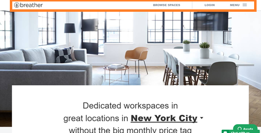
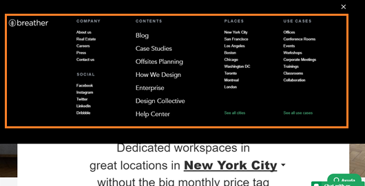
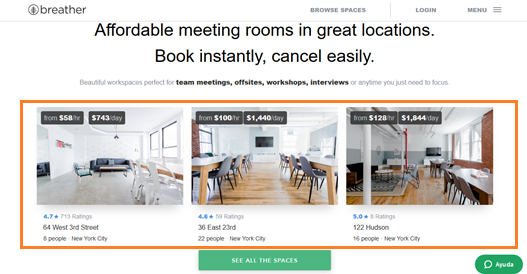
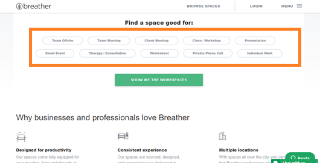
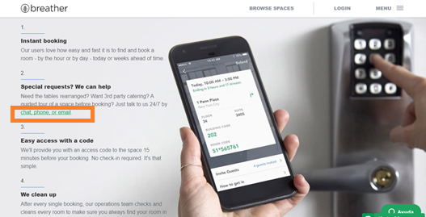

# Breather

Identificaremos los tipos de navegación que hay en la página de Breather: https://breather.com 
    
_Menú - Navegación global_

    
_Footer - Navegación global_
    

    
_Acerca - Navegación local_

    
_Recomendaciones - Navegación contextual_
    

    
_Encuentra un buen espacio - Navegación filtrada_
    

_Cómo funciona - Navegación inline_
    

    
_Filtro por día y duración - Navegación filtrada_
    

    
