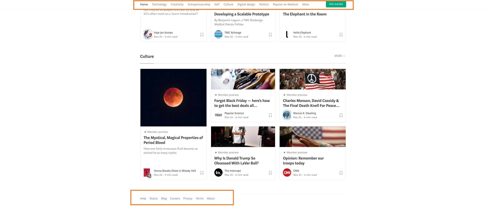
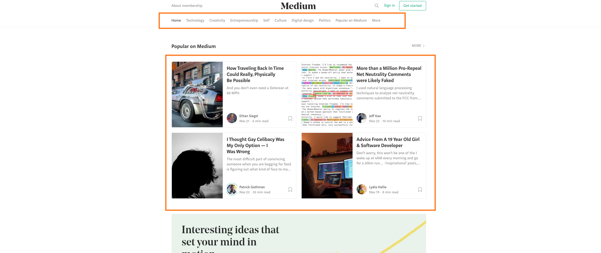
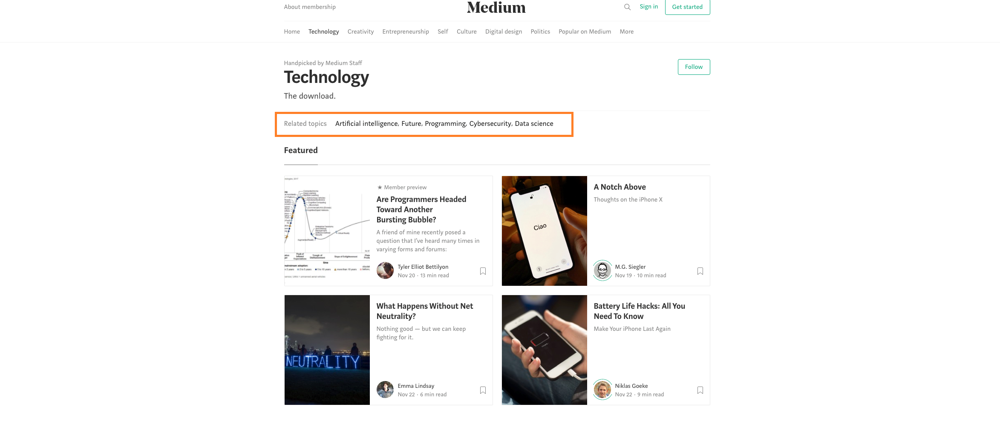
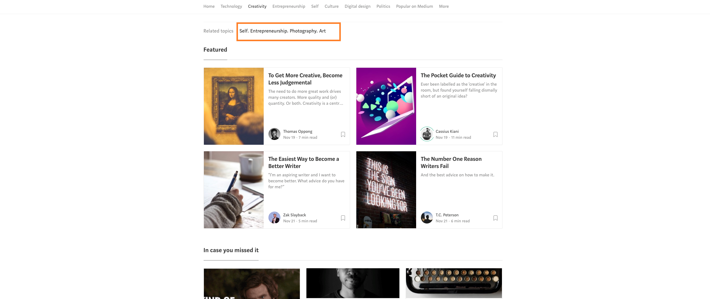
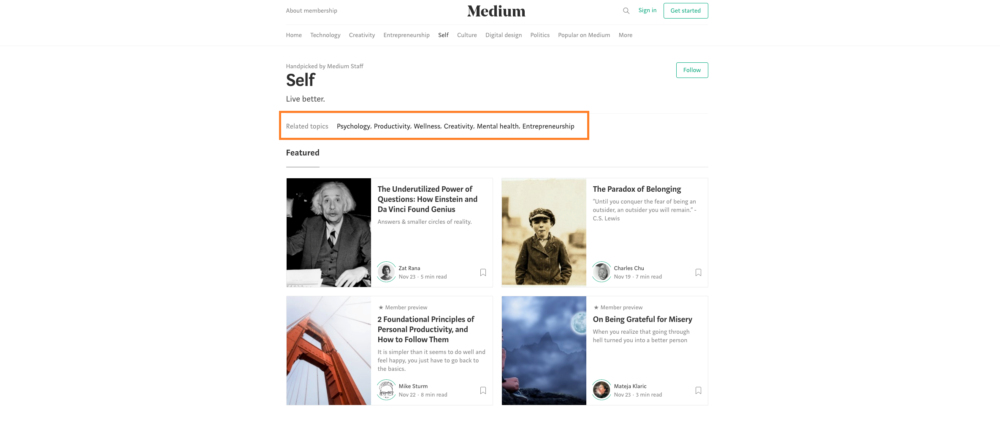
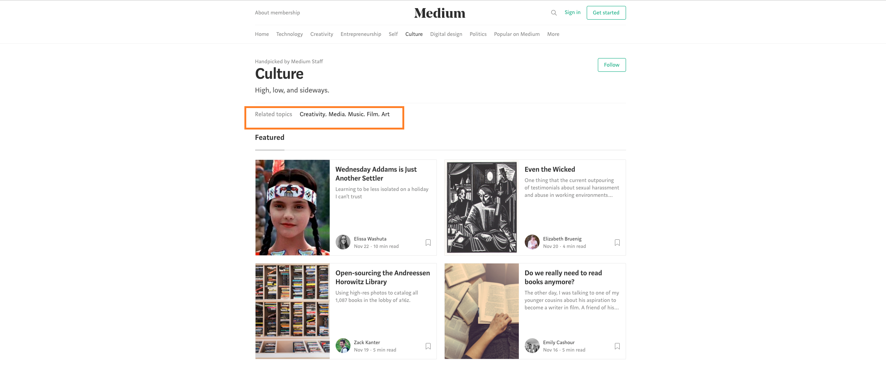
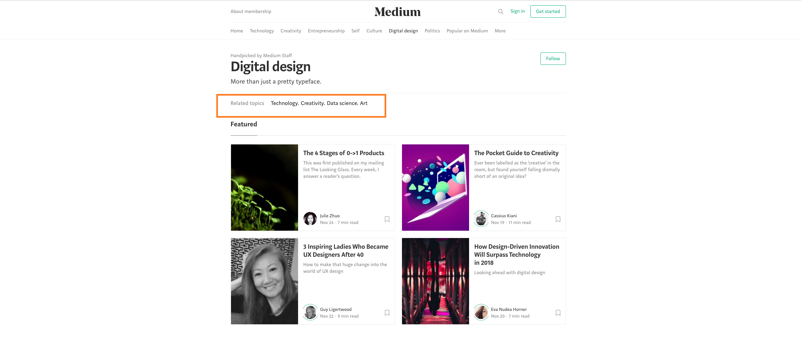
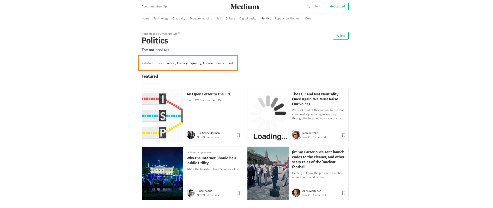

# Medium

Identificaremos los tipos de navegación que hay en la página de GitHub: https://medium.com 
    
_Menú y footer - Navegación global_

    
_Submenú y populares en Medium - Navegación local y contextual_

    
_Tecnología - Navegación facetada_
    

    
_Creatividad - Navegación facetada_
    

    
_Emprendimiento - Navegación facetada_
    

_Self - Navegación facetada_
    

    
_Cultura - Navegación facetada_
    

_Diseño digital - Navegación facetada_

    
_Política - Navegación facetada_
    

